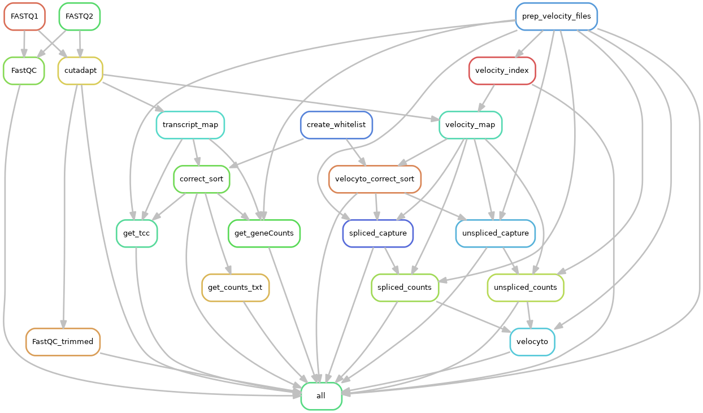
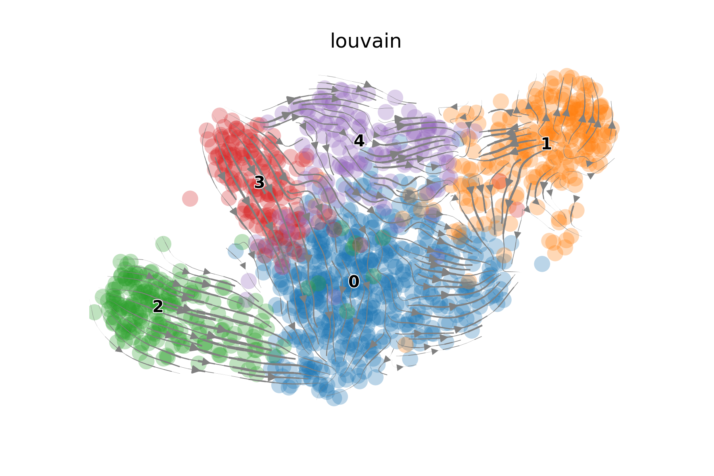

# scRIApipe

single-cell **R**NA **I**soform **A**nalysis **Pipe**line

**Author: @vivekbhr**

## DAG



## How to run

1. Clone the repo

```
git clone https://github.com/vivekbhr/scRIApipe.git
```

2. Go to the cloned directory and set up conda env for the workflow

```
cd scRIApipe
conda env create -f env.yaml -n scria
```

3. configure the config.yaml

The workflow needs
1) path to a cDNA fasta file
2) path to a GTF file
3) UCSC ID of the genome

cDNA fasta and GTF can be downloaded [here](https://www.ensembl.org/info/data/ftp/index.html)
UCSC ID is, for example "mm10" (mouse) or "hg38" (human)

Copy the config.yaml from the folder to your output folder (where you intend to run the pipeline) and replace the information with your relevant information.

4. Test bustools binary

Current release of bustools has a bug, therefore I provided a compiled (bugfixed) bustools with the workflow. Check that it works by trying

```
cd tools && kallisto
```

If the help appears, we are set! If not, we need to recompile bustools for your system. Do the following (outside of scRIApipe directory):

```
git clone https://github.com/BUStools/bustools.git
cd bustools && git checkout devel
mkdir build && cd build && cmake ..
make
```

If there are no errors, copy the bustools binary to the scRIApipe tools folder (if error, look for help)

```
cp bustools <scRIApipe_folder>/tools/
```

5. Workflow is now set, do the following to run the Workflow

```
conda activate scria
<scRIApipe_folder>/scRIA -i fastq_folder -o output_folder -c <your>config.yaml -j <jobs> -cl
```

here **j** is the number of parallel josb you want to run, **-cl** means submit to cluster (default is to run locally)

After running the pipeline, **LOG** file are stored in the /log/ directory and the workflow top-level log is in scRIA.log file.

**NOTE: memory errors**
Index builing needs >40G of memory, if the workflow fails and the *logs/velocity_index.err* says something like `std::badalloc`, increase memory in the file `cluster_config.yaml` in the scRIA folder.

## Output

Major outputs of the workflow are:

  - Transcript compatibility counts (TCC) in folder `<outdir>/transcripts_quant/<sample>/eq_counts/tcc.mtx`
  - Gene counts in folder `<outdir>/transcripts_quant/<sample>/gene_counts/gene.mtx`
  - RNA velocity output in folder `<outdir>/velocity_output` (normal/filtered loom files, velocity plots)


